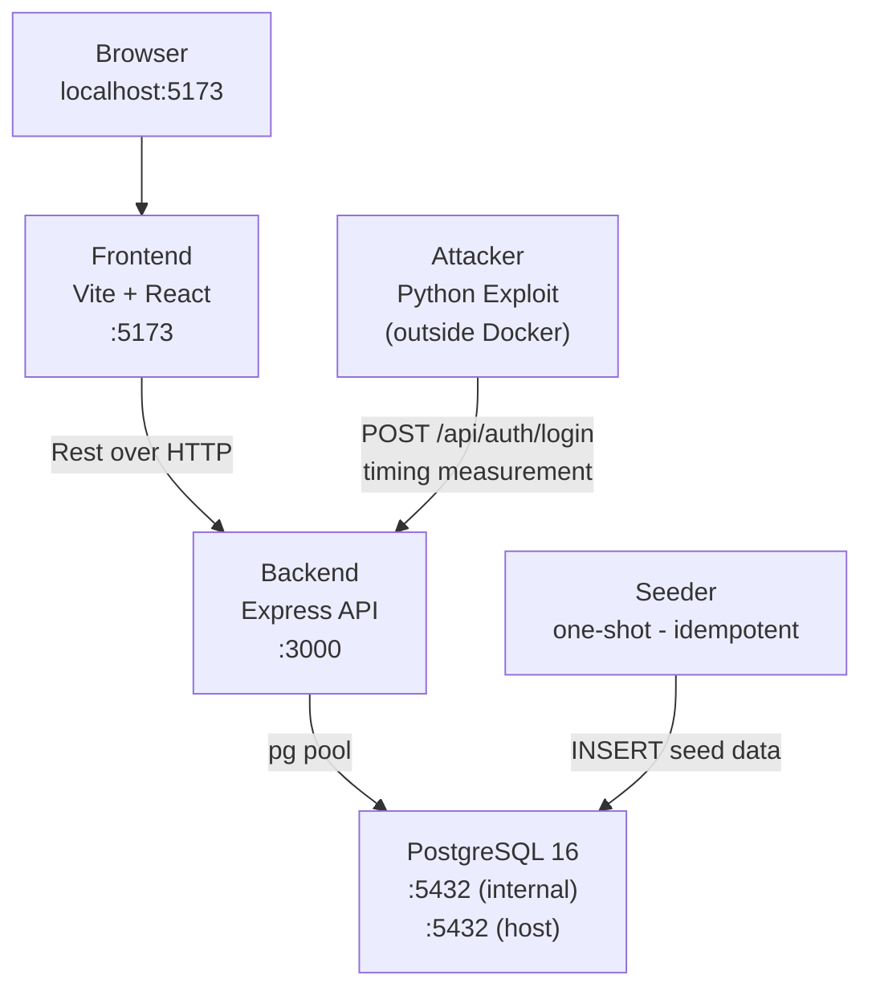
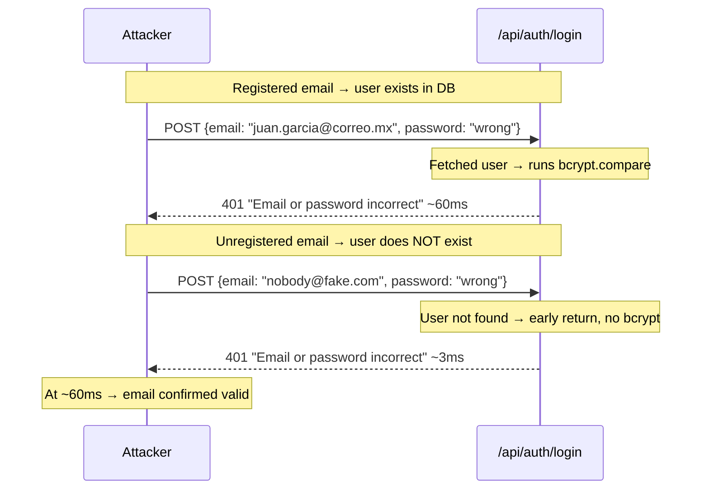
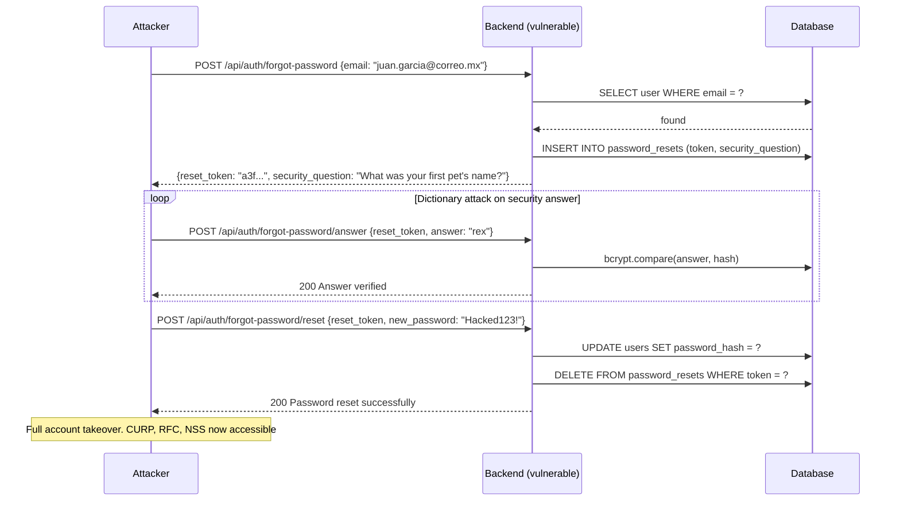
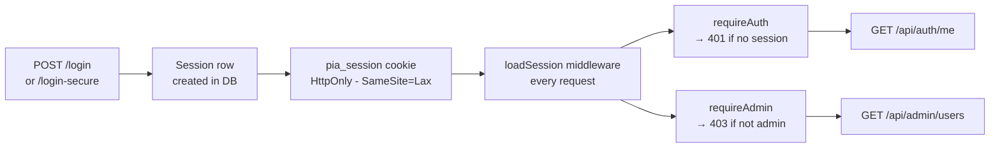

# Timing Attacks Demo — Final Project

> **Academic project only This system is intentionally vulnerable. Do not deploy to production or use against real targets.**

A full-stack web application demonstrating real-world timing attacks against authentication endpoints. Built as final project for an information security course and driven by pure personal curiosity, it simulates a Mexican government-style portal storing sensitive personal data (CURP, RFC, NSS) to show the concrete impact of what looks like a minor implementation flaw.

The core idea: Two endpoints that return the exact same error message can still leak whether a user exists based on _how long_ they take to respond.

---

## Table of Contents

1. [Overview](#overview)
2. [Architecture](#architecture)
3. [Prerequisites](#prerequisites)
4. [Getting Started](#getting%20started)
5. [Project Structure](#project%20structure)
6. [Attack Vectors](#attack%20vectors)
   - [Vector 1 — Login Timing](#vector%201%20—%20login%20timing)
   - [Vector 2 — Forgot-Password Flow](#vector%202%20—%20forgot-password%20flow)
7. [Backend API Reference](#backend%20api%20reference)
8. [Running the Exploit [In development]](#running%20the%20exploit)
9. [Threat Model & Mitigations](#threat%20model%20—%20mitigations)
10. [Seeded Accounts](#seeded%20accounts)
11. [Disclaimer](#disclaimer)

---

## Overview

This project exists to answer a questions that security courses often leave abstract: _how bad is it, really, to leak whether an email is registered?_

The answer the demo gives: bad enough to take over accounts without knowing any password, and expose CURP, RFC, and NSS numbers in the process.

The stack is intentionally simple so the attack surface stays readable:

- The **vulnerable** login endpoint skips bcrypt if the email doesn't exist, shaving ~60ms off the response time and leaking user existence to anyone with a stopwatch.
- A **patched** version runs bcrypt unconditionally against a dummy hash, collapsing the gap to statistical noise.
- A **Python exploit** automates the measurement, enumerate valid emails, and then credential-stuffs the results.

The whole point is to make the attack visible, not to hide it.

---

## Architecture



All services run inside a Docker bridge network (`pia-network`). The exploit runs on the host and reaches the backend through the exposed port 3000.

The seeder is a one-shot container: it inserts the five seed accounts on first startup and exits. On subsequent `docker compose up` runs it detects the populated table and does nothing.

---

## Prerequisites

| Tool   | Version | Notes                            |
| ------ | ------- | -------------------------------- |
| Docker | 24+     | Includes Docker Compose v2       |
| Python | 3.10+   | Only for the exploit             |
| curl   | any     | Optional, for manual API testing |

No Node.js or PostgreSQL installation needed on the host. Both run inside Docker.

---

## Getting Started

First run (from scratch)

### 1. Clone the repository

`git clone 'https://github.com/Nialeksan/Timing-Attack-Example.git'`
`cd timming-attack-pia`

### 2. Build and start everything

`docker compose up --build`

The first build takes a bit longer (2-3 minutes) to pull base images and install dependencies. Subsequent starts are much faster.

Once all services are up:

- Web UI → http://localhost:5173
- API (direct) → http://localhost:3000
- PostgreSQL (host access) → localhost:5434 (user/db from db/.env)

**Verifying the stack**

`docker compose ps`

Expected output:

| NAME         | IMAGE                      | COMMAND                | SERVICE  | CREATED       | STATUS                 | PORTS                                       |
| ------------ | -------------------------- | ---------------------- | -------- | ------------- | ---------------------- | ------------------------------------------- |
| pia-backend  | timing-attack-pia-backend  | "docker-entrypoint.s…" | backend  | X minutes ago | Up X minutes           | 0.0.0.0:3000->3000/tcp, [::]:3000->3000/tcp |
| pia-db       | postgres:16-alpine         | "docker-entrypoint.s…" | db       | X minutes ago | Up X minutes (healthy) | 0.0.0.0:5434->5432/tcp, [::]:5434->5432/tcp |
| pia-frontend | timing-attack-pia-frontend | "docker-entrypoint.s…" | frontend | X minutes ago | Up X minutes           | 0.0.0.0:5173->5173/tcp, [::]:5173->5173/tcp |

The seeder exiting with code 0 is expected (it ran, seeded, and stopped).

**Stopping and resetting**

Stop but keep DB data (fastest restart)
`docker compose down`

Stop and wipe the database (forces a full re-seed on next up)
`docker compose down -v`

**Viewing logs**

`docker compose logs backend`
`docker compose logs seeder`
`docker compose logs frontend`
`docker compose logs db`

> [!NOTE] Use `-f` option for real time logs.

---

## Project Structure

**Structure generated via `eza -T --git-ignore`**

```bash
.
├── backend    # Express API (Node 20, ES Modules)
│   ├── Dockerfile
│   ├── package.json
│   └── src
│       ├── db.js    # PostgreSQL connection pool (singleton by ESM)
│       ├── index.js    # Entry point — middleware stack + route mounting
│       ├── middleware
│       │   └── session.js    # Cookie-based server-side sessions
│       └── routes
│           ├── admin.js    # Admin-only: list all users with sensitive fields
│           ├── auth.js    # VULNERABLE endpoints
│           └── auth.secure.js    # PATCHED endpoints
├── db
│   └── init.sql    # Database schema: users, sessions, password_resets
├── docker-compose.yml    # Orchestrates all four services
├── exploit    # [Still in development]
├── frontend    # Vite + React
│   ├── Dockerfile
│   ├── eslint.config.js
│   ├── index.html
│   ├── package-lock.json
│   ├── package.json
│   ├── public
│   │   └── favicon.svg
│   ├── src
│   │   ├── App.jsx
│   │   ├── components    # ProtectedRoute wrapper
│   │   │   └── ProtectedRoute.jsx
│   │   ├── index.css
│   │   ├── main.jsx
│   │   └── pages    # All project pages
│   │       ├── AdminDashboard.jsx
│   │       ├── Dashboard.jsx
│   │       ├── ForgotPassword.jsx
│   │       ├── Login.jsx
│   │       └── Register.jsx
│   └── vite.config.js
├── README.md
└── seeder    # Idempotent seeder
    ├── Dockerfile
    ├── package.json
    └── seed.js    # Runs once, inserts five accounts, admin included, if db empty
```

---

## Attack Vectors

### Vector 1 — Login Timing

The vulnerable `POST /api/auth/login` handler does this:

```js
const user = await db.query(`SELECT * FROM users WHERE email = $1`, [email]);
if (!user)
  return res.status(401).json({ message: "Email or password incorrect" });

const match = await bcrypt.compare(password, user.password_hash);
if (!match)
  return res.status(401).json({ message: "Email or password incorrect" });
```

Both the "email not found" and "wrong password" branches return identical HTTP status and body. But one runs `bcrytp.compare` and the other doesn't and bcrypt is slow by design. **The gap is detectable from the network**.



_Response times (ms) may vary due to network jitter, but the mean response time remains consistent._

The fix in `POST /api/auth/login-secure`: always call `bcrypt.compare` against a precomputed `DUMMY_HASH`, regardless of whether the user exists. Response time becomes ~60ms in both branches.

### Vector 2 — Forgot-Password Flow

A realistic 3-step password reset that turns user enumeration into full account takeover. **No original password required**.



Security question answers have low entropy (pet names, cities, movies) and can be exhausted with a small dictionary in seconds.

**Authentication flow**:



---

## Backend API Reference

**Base URL:** http://localhost:3000

All requests bodies are JSON (`Content-Type: appliation/json`). Authenticated endpoints expect the `pia_session` cookie, set automatically by the browser or via curl's `-b`/`-c` flags.

**Register**

**Login — vulnerable**

**Login — patched (constant time)**

**Logout**

**Current user**

**Forgot-Password — vulnerable (3 steps)**
**Step 1 — Request reset token**
**Step 2 — Answer security question**
**Step 3 — Set new password**

**Forgot-Password — patched**

**Admin — List all users**

**Running the Exploit**
\[Still in development\]

---

## Running the exploit

\[Still in development\]

---

## Threat Model — Mitigations

---

## Seeded Accounts

Inserted on the first startup by the seeder service. All personal data is fictional generated by AI and for testing only.

| Role  | Email                  | Password   | Security Answer |
| ----- | ---------------------- | ---------- | --------------- |
| admin | admin@pia.mx           | Admin1234! | matrix          |
| user  | juan.garcia@correo.mx  | Password1! | rex             |
| user  | maria.lopez@correo.mx  | Password1! | luna            |
| user  | carlos.ramos@correo.mx | Password1! | monterrey       |
| user  | sofia.mendez@correo.mx | Password1! | michi           |

To force a clean re-seed:
`docker compose down -v --rmi all`
`docker compose up --build`

---

## Disclaimer

This project was built for an academic information security course and is intentionally vulnerable by design. All personal data stored is entirely fictional and generated for testing purposes.

Do not deploy this to any public or production environment. Do not run the exploit against any system you do not own or have explicit permission to test.
