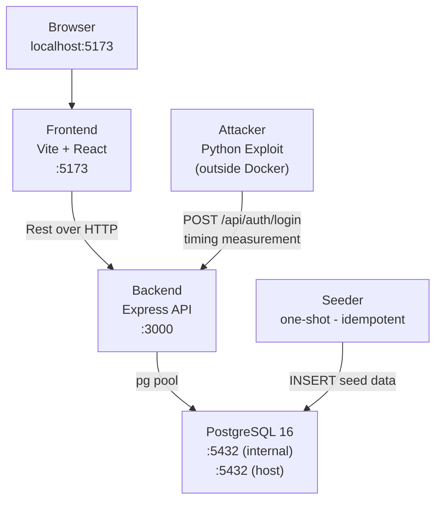
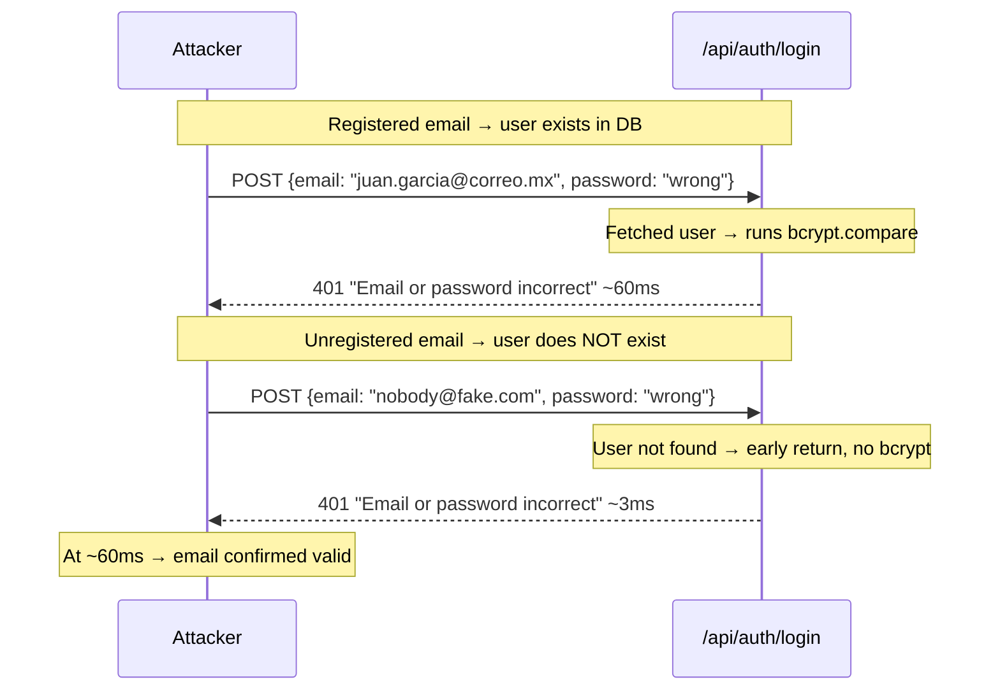
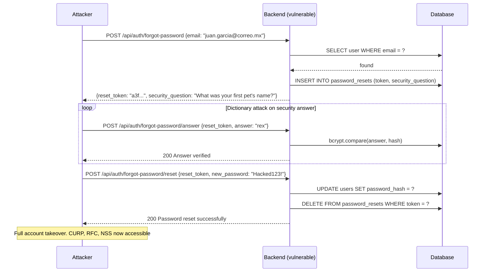
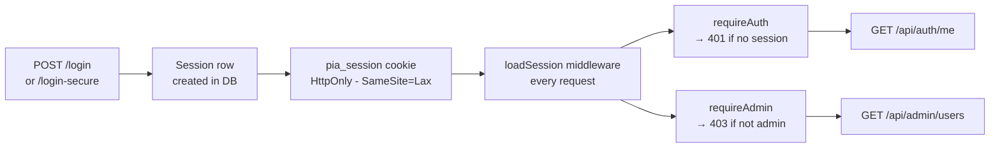

# Timing Attacks Demo — Final Project

> **Academic project only This system is intentionally vulnerable. Do not deploy to production or use against real targets.**

A full-stack web application demonstrating real-world timing attacks against authentication endpoints. Built as final project for an information security course and driven by pure personal curiosity, it simulates a Mexican government-style portal storing sensitive personal data (CURP, RFC, NSS) to show the concrete impact of what looks like a minor implementation flaw.

The core idea: Two endpoints that return the exact same error message can still leak whether a user exists based on _how long_ they take to respond.

---

## Table of Contents

1. [Overview](#overview)
2. [Architecture](#architecture)
3. [Prerequisites](#prerequisites)
4. [Getting Started](#getting%20started)
5. [Project Structure](#project%20structure)
6. [Attack Vectors](#attack%20vectors)
   - [Vector 1 — Login Timing](#vector%201%20—%20login%20timing)
   - [Vector 2 — Forgot-Password Flow](#vector%202%20—%20forgot-password%20flow)
7. [Backend API Reference](#backend%20api%20reference)
8. [Running the Exploit](#running%20the%20exploit)
9. [Threat Model & Mitigations](#threat%20model%20—%20mitigations)
10. [Seeded Accounts](#seeded%20accounts)
11. [Disclaimer](#disclaimer)

---

## Overview

This project exists to answer a questions that security courses often leave abstract: _how bad is it, really, to leak whether an email is registered?_

The answer the demo gives: bad enough to take over accounts without knowing any password, and expose CURP, RFC, and NSS numbers in the process.

The stack is intentionally simple so the attack surface stays readable:

- The **vulnerable** login endpoint skips bcrypt if the email doesn't exist, shaving ~60ms off the response time and leaking user existence to anyone with a stopwatch.
- A **patched** version runs bcrypt unconditionally against a dummy hash, collapsing the gap to statistical noise.
- A **Python exploit** automates the measurement, enumerate valid emails, and then credential-stuffs the results.

The whole point is to make the attack visible, not to hide it.

---

## Architecture



All services run inside a Docker bridge network (`pia-network`). The exploit runs on the host and reaches the backend through the exposed port 3000.

The seeder is a one-shot container: it inserts the five seed accounts on first startup and exits. On subsequent `docker compose up` runs it detects the populated table and does nothing.

---

## Prerequisites

| Tool   | Version | Notes                            |
| ------ | ------- | -------------------------------- |
| Docker | 24+     | Includes Docker Compose v2       |
| Python | 3.10+   | Only for the exploit             |
| curl   | any     | Optional, for manual API testing |

No Node.js or PostgreSQL installation needed on the host. Both run inside Docker.

---

## Getting Started

First run (from scratch)

### 1. Clone the repository

`git clone 'https://github.com/Nialeksan/Timing-Attack-Example.git'`
`cd timming-attack-pia`

### 2. Build and start everything

`docker compose up --build`

The first build takes a bit longer (2-3 minutes) to pull base images and install dependencies. Subsequent starts are much faster.

Once all services are up:

- Web UI → http://localhost:5173
- API (direct) → http://localhost:3000
- PostgreSQL (host access) → localhost:5434 (user/db from db/.env)

**Verifying the stack**

`docker compose ps`

Expected output:

| NAME         | IMAGE                      | COMMAND                | SERVICE  | CREATED       | STATUS                 | PORTS                                       |
| ------------ | -------------------------- | ---------------------- | -------- | ------------- | ---------------------- | ------------------------------------------- |
| pia-backend  | timing-attack-pia-backend  | "docker-entrypoint.s…" | backend  | X minutes ago | Up X minutes           | 0.0.0.0:3000->3000/tcp, [::]:3000->3000/tcp |
| pia-db       | postgres:16-alpine         | "docker-entrypoint.s…" | db       | X minutes ago | Up X minutes (healthy) | 0.0.0.0:5434->5432/tcp, [::]:5434->5432/tcp |
| pia-frontend | timing-attack-pia-frontend | "docker-entrypoint.s…" | frontend | X minutes ago | Up X minutes           | 0.0.0.0:5173->5173/tcp, [::]:5173->5173/tcp |

The seeder exiting with code 0 is expected (it ran, seeded, and stopped).

**Stopping and resetting**

Stop but keep DB data (fastest restart)
`docker compose down`

Stop and wipe the database (forces a full re-seed on next up)
`docker compose down -v`

**Viewing logs**

`docker compose logs backend`
`docker compose logs seeder`
`docker compose logs frontend`
`docker compose logs db`

> [!NOTE] Use `-f` option for real time logs.

---

## Project Structure

**Structure generated via `eza -T --git-ignore`**

```bash
.
├── backend    # Express API (Node 20, ES Modules)
│   ├── Dockerfile
│   ├── package.json
│   └── src
│       ├── db.js    # PostgreSQL connection pool (singleton by ESM)
│       ├── index.js    # Entry point — middleware stack + route mounting
│       ├── middleware
│       │   └── session.js    # Cookie-based server-side sessions
│       └── routes
│           ├── admin.js    # Admin-only: list all users with sensitive fields
│           ├── auth.js    # VULNERABLE endpoints
│           └── auth.secure.js    # PATCHED endpoints
├── db
│   └── init.sql    # Database schema: users, sessions, password_resets
├── docker-compose.yml    # Orchestrates all four services
├── exploit    # Python timing-attack scripts
│   ├── candidates.txt    # Email candidates to probe (one per line)
│   └── exploit-plots/    # Generated plots (created on first run)
│   ├── exploit-vector1.py    # Vector 1: login timing enumeration + credential stuffing
│   ├── wordlist.txt    # Password dictionary for credential stuffing
├── frontend    # Vite + React
│   ├── Dockerfile
│   ├── eslint.config.js
│   ├── index.html
│   ├── package-lock.json
│   ├── package.json
│   ├── public
│   │   └── favicon.svg
│   ├── src
│   │   ├── App.jsx
│   │   ├── components    # ProtectedRoute wrapper
│   │   │   └── ProtectedRoute.jsx
│   │   ├── index.css
│   │   ├── main.jsx
│   │   └── pages    # All project pages
│   │       ├── AdminDashboard.jsx
│   │       ├── Dashboard.jsx
│   │       ├── ForgotPassword.jsx
│   │       ├── Login.jsx
│   │       └── Register.jsx
│   └── vite.config.js
├── README.md
└── seeder    # Idempotent seeder
    ├── Dockerfile
    ├── package.json
    └── seed.js    # Runs once, inserts five accounts, admin included, if db empty
```

---

## Attack Vectors

### Vector 1 — Login Timing

The vulnerable `POST /api/auth/login` handler does this:

```js
const user = await db.query(`SELECT * FROM users WHERE email = $1`, [email]);
if (!user)
  return res.status(401).json({ message: "Email or password incorrect" });

const match = await bcrypt.compare(password, user.password_hash);
if (!match)
  return res.status(401).json({ message: "Email or password incorrect" });
```

Both the "email not found" and "wrong password" branches return identical HTTP status and body. But one runs `bcrytp.compare` and the other doesn't and bcrypt is slow by design. **The gap is detectable from the network**.



_Response times (ms) may vary due to network jitter, but the mean response time remains consistent._

The fix in `POST /api/auth/login-secure`: always call `bcrypt.compare` against a precomputed `DUMMY_HASH`, regardless of whether the user exists. Response time becomes ~60ms in both branches.

### Vector 2 — Forgot-Password Flow

A realistic 3-step password reset that turns user enumeration into full account takeover. **No original password required**.



Security question answers have low entropy (pet names, cities, movies) and can be exhausted with a small dictionary in seconds.

**Authentication flow**:



---

## Backend API Reference

**Base URL:** `http://localhost:3000`

All request bodies are JSON (`Content-Type: application/json`). Authenticated endpoints require the `pia_session` cookie, set automatically by the browser or via curl's `-c`/`-b` flags.

> Examples use bash curl syntax.

---

### POST /api/auth/register

Creates a new account and starts a session.

```bash
curl -s -c cookies.txt -X POST http://localhost:3000/api/auth/register \
  -H "Content-Type: application/json" \
  -d '{
    "email": "test.user@example.com",
    "password": "Password1!",
    "full_name": "Test User",
    "date_of_birth": "1995-03-15",
    "phone": "5551234567",
    "curp": "TUSR950315HDFXXX01",
    "rfc": "TUSR950315XXX",
    "nss": "12345678901",
    "security_question": "What was your first pet name?",
    "security_answer": "firulais"
  }'
```

| Status | Body                                                               |
| ------ | ------------------------------------------------------------------ |
| `201`  | `{ "message": "Account created successfully!!!" }`                 |
| `400`  | `{ "message": "Missing required fields: ..." }`                    |
| `409`  | `{ "message": "An account already exists with that information" }` |

---

### POST /api/auth/login — VULNERABLE

**Timing leak:** returns in ~3 ms when the email is not registered (bcrypt skipped); ~90 ms when it is (bcrypt runs). The ~87 ms gap is detectable over the network and directly powers the exploit.

```bash
# Valid credentials — observe ~90 ms, sets pia_session cookie
curl -s -c cookies.txt -w "\nTime: %{time_total}s\n" \
  -X POST http://localhost:3000/api/auth/login \
  -H "Content-Type: application/json" \
  -d '{"email": "juan.garcia@correo.mx", "password": "Password1!"}'

# Non-existent email — observe ~3 ms (bcrypt skipped, timing leak)
curl -s -w "\nTime: %{time_total}s\n" \
  -X POST http://localhost:3000/api/auth/login \
  -H "Content-Type: application/json" \
  -d '{"email": "nobody@fake.com", "password": "anything"}'
```

| Status | Body                                                                                                                                     |
| ------ | ---------------------------------------------------------------------------------------------------------------------------------------- |
| `200`  | `{ "message": "Logged in successfully!", "role": "user" }`                                                                               |
| `401`  | `{ "message": "Email or password incorrect" }` — identical body for wrong password and non-existent email; timing is the only difference |

---

### POST /api/auth/login-secure — PATCHED

Always runs `bcrypt.compare` against the real hash or a precomputed `DUMMY_HASH`. Uses `crypto.timingSafeEqual` with bitwise `&` to eliminate sub-nanosecond branch-prediction leaks. Response time is ~90 ms regardless of whether the email exists.

```bash
# Non-existent email — also ~90 ms (DUMMY_HASH forces bcrypt to run)
curl -s -w "\nTime: %{time_total}s\n" \
  -X POST http://localhost:3000/api/auth/login-secure \
  -H "Content-Type: application/json" \
  -d '{"email": "nobody@fake.com", "password": "anything"}'
```

---

### POST /api/auth/logout

Deletes the session row from the database and clears the `pia_session` cookie.

```bash
curl -s -b cookies.txt -c cookies.txt \
  -X POST http://localhost:3000/api/auth/logout
```

**Response `200`:** `{ "message": "Session closed" }`

---

### GET /api/auth/me

Returns the authenticated user's profile. Requires a valid `pia_session` cookie.

```bash
curl -s -b cookies.txt http://localhost:3000/api/auth/me
```

| Status | Body                                                                                                                |
| ------ | ------------------------------------------------------------------------------------------------------------------- |
| `200`  | `{ "user": { "id": 2, "email": "juan.garcia@correo.mx", "full_name": "...", "role": "user", "curp": "...", ... } }` |
| `401`  | `{ "message": "Unauthorized" }`                                                                                     |

---

### POST /api/auth/forgot-password — VULNERABLE (Step 1)

**Enumeration leak:** responds `404` for unknown emails and `200` + token for registered ones. User existence is confirmed by HTTP status code alone — no timing analysis needed.

```bash
# Registered email → 200 + token + security question
curl -s -X POST http://localhost:3000/api/auth/forgot-password \
  -H "Content-Type: application/json" \
  -d '{"email": "juan.garcia@correo.mx"}'

# Non-existent email → 404
curl -s -X POST http://localhost:3000/api/auth/forgot-password \
  -H "Content-Type: application/json" \
  -d '{"email": "nobody@fake.com"}'
```

| Status | Body                                                                                           |
| ------ | ---------------------------------------------------------------------------------------------- |
| `200`  | `{ "reset_token": "<128 hex chars>", "security_question": "What was your first pet's name?" }` |
| `404`  | `{ "message": "No account found" }`                                                            |

---

### POST /api/auth/forgot-password/answer — VULNERABLE (Step 2)

**Timing leak:** early-returns (no bcrypt) when the token is invalid or expired; runs `bcrypt.compare` (~90 ms) only for valid tokens, leaking whether Step 1 succeeded.

```bash
curl -s -X POST http://localhost:3000/api/auth/forgot-password/answer \
  -H "Content-Type: application/json" \
  -d '{"reset_token": "<token from step 1>", "answer": "rex"}'
```

| Status | Body                                                                               |
| ------ | ---------------------------------------------------------------------------------- |
| `200`  | `{ "message": "Answer verified successfully!" }`                                   |
| `401`  | `{ "message": "Incorrect answer" }` or `{ "message": "Invalid or expired token" }` |

---

### POST /api/auth/forgot-password/reset (Step 3)

Sets a new password. Requires `answer_verified = true` on the token. Updates `password_hash` and deletes the reset row in a single transaction. Not a timing vector — the 512-bit token cannot be guessed.

```bash
curl -s -X POST http://localhost:3000/api/auth/forgot-password/reset \
  -H "Content-Type: application/json" \
  -d '{"reset_token": "<token from step 1>", "new_password": "NewPassword1!"}'
```

**Response `200`:** `{ "message": "Password reset successfully!" }`

---

### Forgot-Password — Patched (`-secure` variants)

| Step | Endpoint                                       | Fix                                                                                                                            |
| ---- | ---------------------------------------------- | ------------------------------------------------------------------------------------------------------------------------------ |
| 1    | `POST /api/auth/forgot-password-secure`        | Always `200` — unknown emails get `"Check your email for reset instructions"` instead of `404`                                 |
| 2    | `POST /api/auth/forgot-password-secure/answer` | Resolves hash _before_ any branch on token validity so `bcrypt.compare` always runs; result passed to `crypto.timingSafeEqual` |
| 3    | `POST /api/auth/forgot-password-secure/reset`  | Identical to vulnerable version — no timing vector at this stage                                                               |

```bash
# Step 1 — unknown email returns 200, not 404
curl -s -X POST http://localhost:3000/api/auth/forgot-password-secure \
  -H "Content-Type: application/json" \
  -d '{"email": "nobody@fake.com"}'
# → 200 { "message": "Check your email for reset instructions" }

# Step 2
curl -s -X POST http://localhost:3000/api/auth/forgot-password-secure/answer \
  -H "Content-Type: application/json" \
  -d '{"reset_token": "<token>", "answer": "rex"}'

# Step 3
curl -s -X POST http://localhost:3000/api/auth/forgot-password-secure/reset \
  -H "Content-Type: application/json" \
  -d '{"reset_token": "<token>", "new_password": "NewPassword1!"}'
```

---

### GET /api/admin/users

Returns all users with sensitive fields (CURP, RFC, NSS, date of birth, phone), ordered by `created_at ASC`. Requires an active session with `role = 'admin'`.

```bash
# Log in as admin first
curl -s -c cookies.txt -X POST http://localhost:3000/api/auth/login \
  -H "Content-Type: application/json" \
  -d '{"email": "admin@pia.mx", "password": "Admin1234!"}'

# Fetch all users
curl -s -b cookies.txt http://localhost:3000/api/admin/users
```

| Status | Body                                                               |
| ------ | ------------------------------------------------------------------ |
| `200`  | Array of user objects with all fields, ordered by `created_at ASC` |
| `401`  | `{ "message": "Unauthorized" }` — no active session                |
| `403`  | `{ "message": "Forbidden" }` — session exists but not admin        |

---

## Running the Exploit

> This section covers Vector 1 only (login timing enumeration + credential stuffing). The Vector 2 exploit is not yet implemented.

### Prerequisites

```bash
pip install requests matplotlib python-dotenv
```

Python 3.10+ required. No `requirements.txt` is currently included — install the three packages above manually.

### Input files

The exploit reads two plain-text files from the `exploit/` directory:

**`candidates.txt`** — one email address per line; lines starting with `#` are ignored:

```
# Known-valid seeds (included to anchor the bcrypt cluster)
juan.garcia@correo.mx
maria.lopez@correo.mx
carlos.ramos@correo.mx
sofia.mendez@correo.mx
admin@pia.mx

# Decoys (expected to be INVALID)
fake1@notreal.com
fake2@notreal.com
```

**`wordlist.txt`** — one password per line, tried in order during credential stuffing:

```
Password1!
Admin1234!
password123
```

### Environment

Create `exploit/.env` to override the target URL (optional):

```
TARGET_URL=http://localhost:3000
```

Defaults to `http://localhost:3000` if no `.env` is present.

### Running

```bash
cd exploit
python exploit-vector1.py
```

All seven phases run automatically. With 10 candidates, 20 warmup rounds, and 50 sample rounds at 330 ms/request the full run takes approximately 40–50 minutes. Plots are saved to `exploit-plots/` at the end.

---

### How It Works

#### Phase 0 — Fingerprinting

Sends one probe request and reads the `RateLimit-Policy` and `RateLimit` headers to calculate a safe inter-request delay without any prior knowledge of the server's limits:

```
RateLimit-Policy: 200;w=60
RateLimit:        limit=200, remaining=199, reset=60
```

From these the script derives:

| Variable   | Formula                     | Example (200 req/60 s) |
| ---------- | --------------------------- | ---------------------- |
| `inter_ms` | `(window_ms / limit) × 1.1` | 330 ms                 |
| `throttle` | `max(5, limit × 0.10)`      | 20 remaining           |

The 1.1× multiplier adds 10% headroom so the exploit never exhausts the full rate-limit window. If headers are absent, conservative defaults are used (`inter_ms = 500 ms`, `throttle = 10`).

**Reactive throttling (`measure()`):** on every response the script also checks `RateLimit-Remaining`. When the remaining budget drops below `throttle`, it proactively sleeps `reset_secs / remaining` seconds to spread the budget across the window. If a `429` is received anyway, it reads the reset time from the header and sleeps the full window before retrying.

---

#### Phase 1 — Warm-Up

Sends `WARMUP = 20` rounds of requests to every candidate before measurement begins.

The first few requests to any server are slower: TCP connections haven't been reused, Node's V8 JIT hasn't compiled the hot path, PostgreSQL's query planner cache is cold, and OS routing state is not cached. Without warm-up, early measurements are outliers that skew medians upward and inflate noise. After 20 rounds the server is in steady state.

---

#### Phase 2 — Interleaved Measurement

Sends `SAMPLES = 50` rounds, collecting one nanosecond-precision sample per email per round using `time.perf_counter_ns()`. The email order is **randomized per round**:

```python
shuffled = random.sample(emails, len(emails))
```

**Why randomize?** bcrypt's Blowfish cipher state is ~4 KB. It fits in CPU L3 cache. With a fixed round-robin order, the email immediately following a valid user in the sequence benefits from a warm cache — its bcrypt runs in ~48 ms instead of ~90 ms, which places a valid user below the decision threshold and causes it to be misclassified as `INVALID`.

This is **CPU cache-warming positional bias**: the effect is 100% deterministic in fixed order, affecting every round.

With random ordering the probability that a specific email follows a valid user in any given round drops to ~20% (random, not guaranteed). Over 50 rounds, cache-warm samples become ~10% of the total; the median correctly reflects the cold-cache bcrypt cost (~90 ms).

This is a direct application of **randomized block design**: shuffling converts a systematic error into uncorrelated noise that the median naturally suppresses.

> **Observed failure mode (documented):** In a prior run with fixed round-robin order and 100 samples, `maria.lopez` and `sofia.mendez` — both valid users — consistently measured at ~48 ms and were classified `INVALID`. They were the emails immediately following other valid users in the fixed sequence. After adding the per-round shuffle, all 5 valid users were correctly classified.

---

#### Phase 3 — IQR Outlier Removal

Each email's 50 samples are cleaned with **Tukey fences** (IQR method):

```
Q1 = 25th percentile
Q3 = 75th percentile
IQR = Q3 − Q1

Lower fence = Q1 − 1.5 × IQR
Upper fence = Q3 + 1.5 × IQR
```

Samples outside the fences are discarded before statistics are computed. The method is non-parametric — it makes no assumption about the distribution shape, which matters here because network timing distributions are right-skewed (occasional spikes from retransmits, GC pauses, Docker overhead). Typical removal rate is 0–6% per email with 50 samples.

---

#### Phases 4 & 5 — Statistics and Classification

**Median and MAD** are computed on cleaned samples for each email:

```
median = middle value of the sorted sample list
MAD    = median(|xi − median|)
```

MAD (Median Absolute Deviation) is the robust analog of standard deviation for non-normal distributions. Unlike standard deviation, it is not inflated by the occasional large outlier that survived IQR cleaning.

**Max-gap algorithm** finds the threshold automatically:

1. Sort all per-email medians in ascending order.
2. Compute the gap between each consecutive pair.
3. The largest gap splits the distribution into two clusters.
4. Threshold = midpoint of that gap.
5. Emails above threshold → `VALID`; below → `INVALID`.

No prior knowledge of timing values is needed. The threshold self-calibrates to whatever bimodal distribution is observed.

**Confidence ratio** measures whether the gap is real or noise:

```
confidence = gap_size / MAD_of_lower_cluster
```

A ratio ≥ 3.0 means the gap is at least 3× wider than the spread of the lower cluster — reliable enough to trust. Below 3.0, all emails are classified `UNCERTAIN`.

**Results from confirmed run (50 samples, shuffled, localhost):**

```
Threshold:  67.76 ms
Confidence: 184.8x  (reliable)

VALID      admin@pia.mx                  ~91 ms
VALID      juan.garcia@correo.mx         ~89 ms
VALID      maria.lopez@correo.mx         ~92 ms
VALID      carlos.ramos@correo.mx        ~91 ms
VALID      sofia.mendez@correo.mx        ~89 ms
INVALID    fake1@notreal.com              ~3 ms
INVALID    fake2@notreal.com              ~3 ms
INVALID    fake3@notreal.com              ~3 ms
INVALID    fake4@notreal.com              ~3 ms
INVALID    fake5@notreal.com              ~3 ms
```

A confidence of 184.8× means the two clusters are separated by a gap nearly 185 times wider than the noise floor. This is an unambiguous signal.

---

#### Phase 6 — Credential Stuffing

For each `VALID` email, the script tries every password in `wordlist.txt` in order against `POST /api/auth/login`.

**Results from confirmed run:**

```
[+] COMPROMISED  admin@pia.mx                Admin1234!  (role: admin)
[+] COMPROMISED  juan.garcia@correo.mx       Password1!  (role: user)
[+] COMPROMISED  maria.lopez@correo.mx       Password1!  (role: user)
[+] COMPROMISED  carlos.ramos@correo.mx      Password1!  (role: user)
[+] COMPROMISED  sofia.mendez@correo.mx      Password1!  (role: user)

Summary: 5 valid — 5 compromised
```

With an admin session, the attacker can call `GET /api/admin/users` and retrieve CURP, RFC, and NSS for all accounts.

---

#### Phase 7 — Patch Verification

Repeats Phase 2–5 against `POST /api/auth/login-secure` and reports the confidence ratio.

**Results from confirmed run:**

```
Secure endpoint confidence ratio: 1.3x
Patch verified. No exploitable timing gap detected.
```

A ratio of 1.3× is below the 3.0× threshold, confirming that `DUMMY_HASH` successfully flattens the timing distribution.

---

### Output Plots

The exploit saves two plots to `exploit-plots/` on every run.

**`phase1_timing.png`** — Strip scatter plot. Each dot is one raw sample. The X axis lists all candidate emails; the Y axis is response time in ms. A dashed red line marks the threshold (67.76 ms). Colors: red = `VALID`, blue = `INVALID`, orange = `UNCERTAIN`. Valid-user columns show a tight cluster near ~90 ms with a small scatter of cache-warm samples below. Invalid-user columns cluster near ~3 ms.

**`comparison.png`** — Side-by-side box plots. Left panel: vulnerable `/api/auth/login`. Right panel: patched `/api/auth/login-secure`. Both panels share the Y axis. The vulnerable panel shows two clearly separated clusters (~3 ms vs ~90 ms). The patched panel shows all boxes overlapping near ~90 ms — no exploitable gap. The threshold line is drawn on the vulnerable panel only.

---

## Threat Model — Mitigations

### Vector 1 — Login Timing (CWE-208)

**Root cause:** `POST /api/auth/login` returns immediately (~3 ms) when the queried email is not in the database, skipping `bcrypt.compare`. bcrypt is designed to be slow by construction (cost factor 10 ≈ 90 ms on commodity hardware). Skipping it produces a response time 20–30× shorter for non-existent users than for valid ones — a gap measurable over the network with a stopwatch.

**Why identical error messages are not enough:** Both branches return `401 { "message": "Email or password incorrect" }`. Body and status code are identical. But response time is a separate side channel. An attacker with `time.perf_counter_ns()` can distinguish the two branches from across the network.

**Why rate limiting does not defend against this:** Rate limiting slows an attacker down but does not close the timing gap. The exploit needs only ~50 samples per email to classify it with a confidence ratio of 184.8×. At 330 ms/request that is ~16 seconds per email — well within any realistic limit. The demo server allows 200 req/min; 200 candidate emails could be fully enumerated in under one hour without a single `429`.

**Patch (`POST /api/auth/login-secure`):** Two techniques in combination:

1. **`DUMMY_HASH`** — a bcrypt hash computed at module load time via ESM top-level await. When the email is not found, `bcrypt.compare` is called against `DUMMY_HASH` instead of being skipped. Both branches now pay the full ~90 ms bcrypt cost.

2. **`crypto.timingSafeEqual` with bitwise `&`** — the final boolean check uses a constant-time buffer comparison instead of a plain `&&`. Without this, a CPU branch predictor or speculative-execution engine could still resolve the boolean in sub-nanosecond time, leaving a measurable discrepancy for a co-located attacker. Bitwise `&` forces both operands to be fully evaluated before the comparison:

```js
const valid = crypto.timingSafeEqual(
  Buffer.from([Number(user !== null) & Number(passwordMatches)]),
  Buffer.from([1]),
);
```

**Patch verification result:** Running the exploit against `/login-secure` produced a confidence ratio of **1.3×** (threshold: 3.0×). No exploitable gap detected.

---

### Vector 2 — Forgot-Password Enumeration

**Root cause — Step 1 (status code leak):** `POST /api/auth/forgot-password` returns `404` for unregistered emails and `200 + reset_token + security_question` for registered ones. The HTTP status code alone confirms user existence — no timing measurement or statistical analysis required.

**Root cause — Step 2 (timing leak):** `POST /api/auth/forgot-password/answer` early-returns when the reset token is invalid or expired, skipping `bcrypt.compare`. An attacker who obtained a valid token in Step 1 can probe this endpoint: a fast response (~3 ms) means the token was invalid; a slow response (~90 ms) means bcrypt ran and the token was valid. This leaks whether Step 1 succeeded for a given email.

**Full exploit chain (no original password needed):**

1. `POST /forgot-password {email}` — `200` vs `404` confirms the email is registered and returns the security question.
2. Dictionary attack on the security answer — most answers (pet names, cities, movies) have fewer than 10,000 plausible values. At ~90 ms per attempt and 200 req/min, a 1,000-entry dictionary is exhausted in under 10 minutes. `bcrypt.compare` is constant-time with respect to input content, so the answer entropy is the only defense here.
3. `POST /forgot-password/reset {token, new_password}` — account takeover. CURP, RFC, and NSS are now accessible via `/api/auth/me` or `/api/admin/users`.

**Patch (`POST /api/auth/forgot-password-secure`):**

- **Step 1:** Always returns `200 { "message": "Check your email for reset instructions" }`, regardless of whether the email is registered. Unknown emails get an indistinguishable response. (In a production system with SMTP, the reset link arrives by email — the response was always going to be identical to the requester.)

- **Step 2:** Resolves `hashToUse = record?.security_answer_hash ?? DUMMY_HASH` _before_ any branch on token validity, so `bcrypt.compare` always runs:

```js
const hashToUse = record?.security_answer_hash ?? DUMMY_HASH;
const matches = await bcrypt.compare(answer.toLowerCase(), hashToUse);
const tokenValid = record !== null && new Date(record.expires_at) >= new Date();
const valid = crypto.timingSafeEqual(
  Buffer.from([Number(tokenValid) & Number(matches)]),
  Buffer.from([1]),
);
```

- **Step 3:** No change needed. The 512-bit reset token cannot be guessed, so timing at this stage leaks nothing not already known from Steps 1 and 2.

---

### Regulatory Context

In the Mexican regulatory framework, confirming that an account linked to CURP, RFC, or NSS exists constitutes a privacy breach under LFPDPPP art. 19, even if no field values are directly exfiltrated. The vulnerability demonstrated here maps to **CWE-204** (Observable Response Discrepancy) and **MITRE ATT&CK T1589.002** (Gather Victim Identity Information: Email Addresses). Both vectors enable credential stuffing, password spraying, spear phishing, and account takeover without the original password.

---

## Seeded Accounts

Inserted on the first startup by the seeder service. All personal data is fictional generated by AI and for testing only.

| Role  | Email                  | Password   | Security Answer |
| ----- | ---------------------- | ---------- | --------------- |
| admin | admin@pia.mx           | Admin1234! | matrix          |
| user  | juan.garcia@correo.mx  | Password1! | rex             |
| user  | maria.lopez@correo.mx  | Password1! | luna            |
| user  | carlos.ramos@correo.mx | Password1! | monterrey       |
| user  | sofia.mendez@correo.mx | Password1! | michi           |

To force a clean re-seed:
`docker compose down -v --rmi all`
`docker compose up --build`

---

## Disclaimer

This project was built for an academic information security course and is intentionally vulnerable by design. All personal data stored is entirely fictional and generated for testing purposes.

Do not deploy this to any public or production environment. Do not run the exploit against any system you do not own or have explicit permission to test.
